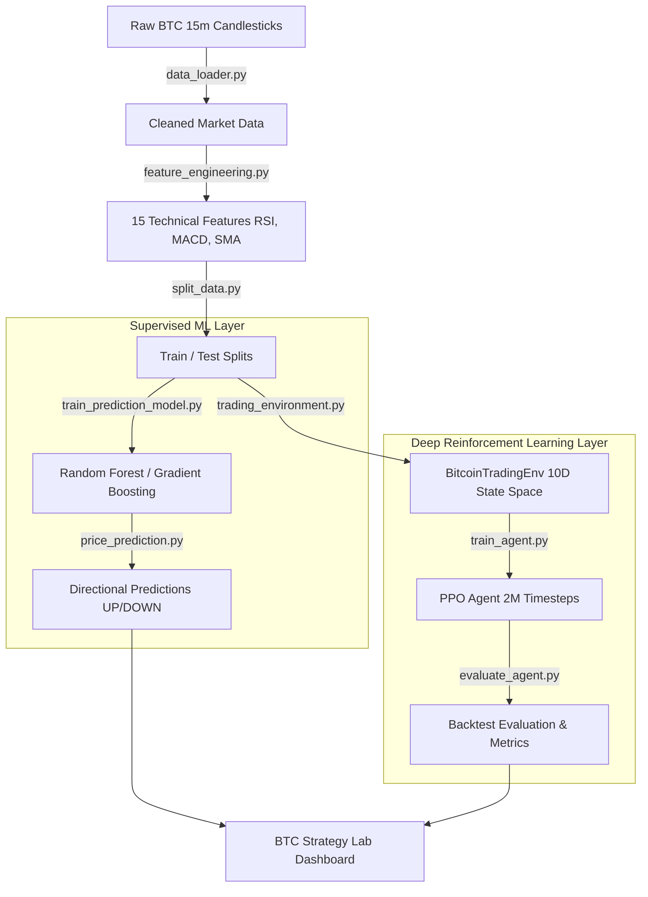

# AI-Powered Algorithmic Trading Bot using Deep Reinforcement Learning

[](https://www.python.org/)
[](https://stable-baselines3.readthedocs.io/)
[](https://gymnasium.farama.org/)
[](https://streamlit.io/)


An end-to-end quantitative trading system and research terminal designed for **Bitcoin (BTC/USDT)** high-frequency 15-minute candlestick market data. The project combines **Deep Reinforcement Learning (PPO)** for portfolio execution and **Supervised Ensemble Machine Learning (Random Forest & Gradient Boosting)** for price direction forecasting.

Includes a custom **Gymnasium** environment with realistic transaction fee friction (0.1%), comprehensive technical indicator feature engineering, automated backtesting, and an interactive **Streamlit & Plotly** strategy lab dashboard.

---

## System Architecture



---

## Key Features

* **Custom Gymnasium Trading Environment (`BitcoinTradingEnv`)**:
  * **Observation Space**: 10-dimensional state vector incorporating price ratios, volume trends, RSI(14), MACD histogram, rolling volatility, SMA crossover signals, current portfolio allocation ratio, and unrealized profit/loss.
  * **Action Space**: Discrete actions `0` (Hold), `1` (Buy), and `2` (Sell).
  * **Transaction Costs**: Real-world execution simulation with `0.1%` fee per trade.
* **Deep Reinforcement Learning Trading Agent**:
  * Algorithm: **Proximal Policy Optimization (PPO)** via `Stable-Baselines3`.
  * Training: **2,000,000 timesteps** with dynamic entropy coefficient (`0.01`) for optimal exploration-exploitation tradeoff.
  * Policy Architecture: Custom `[128, 128]` MLP for both Policy ($\pi$) and Value ($V$) networks.
* **Directional Machine Learning Model**:
  * Classifiers: **Random Forest** and **HistGradientBoosting** predicting next 15-minute candle price movements ($\Delta P > 0$).
  * Feature Engineering: 15 technical indicators including RSI, MACD, SMA(10, 20, 50) crossovers, candle height, volume changes, and return lags.
* **Backtesting & Financial Performance Suite**:
  * Measures strategy metrics against a **Buy & Hold benchmark**.
  * Calculates **Sharpe Ratio**, **Maximum Drawdown (MDD)**, **Win Rate**, **Profit Factor**, and **Cumulative Portfolio Return**.
* **Interactive Strategy Dashboard (`BTC Strategy Lab`)**:
  * Streamlit web terminal featuring interactive **Plotly** candlestick charts with buy/sell entry signals.
  * Equity curve comparison plots between the PPO agent and Buy-and-Hold strategy.
  * Live directional predictions table with confidence scores.
  * Model feature importance visualization.

---

## Project Directory Structure

```text
AI-Powered Algorithmic Trading Bot/
├── dashboard/
│   └── app.py                     # Streamlit interactive research terminal & dashboard
├── data/
│   ├── raw/                       # Raw historical BTC 15-minute candlestick data
│   └── processed/                 # Cleaned datasets, train/test splits, evaluation logs
├── models/                        # Saved PPO agent (.zip) & ML model weights (.joblib)
├── src/
│   ├── data_loader.py             # Data cleaning, timestamp formatting, and preprocessing
│   ├── feature_engineering.py     # Computes technical indicators (RSI, MACD, SMA, Volatility)
│   ├── split_data.py              # Chronological 80/20 train/test data splitting
│   ├── trading_environment.py     # Custom Gymnasium environment with 10D observation space
│   ├── test_environment.py        # Environment sanity testing & step verification
│   ├── train_agent.py             # PPO agent training script (2M timesteps)
│   ├── evaluate_agent.py          # Backtest evaluation script vs Buy-and-Hold benchmark
│   ├── train_prediction_model.py  # Supervised direction classifier training (RF / HGB)
│   ├── price_prediction.py        # Direction prediction inference on test data
│   └── performance_metrics.py     # Financial metric functions (Sharpe, Drawdown, Win Rate)
├── .gitignore                     # Git rules to exclude heavy datasets and binaries
├── README.md                      # Comprehensive project documentation
└── requirements.txt               # Python package dependencies
```

---

## Technical Details

### 1. DRL State Vector (10 Dimensions)

| Index | Feature | Description |
| :--- | :--- | :--- |
| `0` | **Price vs SMA-20** | `(Close - SMA_20) / SMA_20` ratio |
| `1` | **Log Volume** | Normalized log-scale trading volume |
| `2` | **Return** | Percentage price change of current candle |
| `3` | **Price Change** | Dollar change relative to close price |
| `4` | **Position Ratio** | Current BTC holding value / Total Net Worth |
| `5` | **RSI (Normalized)** | Relative Strength Index scaled to range `[-1, 1]` |
| `6` | **MACD Histogram** | Normalized MACD signal difference |
| `7` | **Volatility** | 20-period rolling return standard deviation |
| `8` | **SMA Crossover** | Difference between SMA-10 and SMA-20 |
| `9` | **Unrealized PnL** | Profit/loss percentage on active position |

### 2. Supervised Direction Model Features (15 Features)
`Return`, `SMA_Cross`, `Volume_Change`, `Volatility`, `RSI`, `MACD`, `MACD_Signal`, `MACD_Hist`, `High_Low`, `Return_Lag1`, `Return_Lag2`, `Return_Lag3`, `Momentum_5`, `Momentum_10`.

---

## Quick Start Guide

### 1. Prerequisites & Installation

Clone the repository and set up your Python environment:

```bash
# Clone repository
git clone https://github.com/adityarana242005-star/Agent-AI-Powered-Algorithmic-Trading-Bot.git
cd Agent-AI-Powered-Algorithmic-Trading-Bot

# Create and activate virtual environment (optional but recommended)
python3 -m venv venv
source venv/bin/activate  # On Windows: venv\Scripts\activate

# Install dependencies
pip install -r requirements.txt
```

### 2. Run the Interactive Dashboard

Launch the Streamlit research terminal directly:

```bash
streamlit run dashboard/app.py
```

### 3. Pipeline Execution (Train from Scratch)

To re-run data processing, model training, and agent evaluation sequentially:

```bash
# Step 1: Preprocess raw market data
python src/data_loader.py

# Step 2: Feature Engineering (RSI, MACD, Moving Averages)
python src/feature_engineering.py

# Step 3: Chronological Train/Test Split (80/20)
python src/split_data.py

# Step 4: Train Supervised Price Direction Model (Random Forest / Gradient Boosting)
python src/train_prediction_model.py

# Step 5: Run Direction Predictions on Test Data
python src/price_prediction.py

# Step 6: Train Deep Reinforcement Learning Agent (PPO - 2M Steps)
python src/train_agent.py

# Step 7: Backtest & Evaluate Agent vs. Buy-and-Hold
python src/evaluate_agent.py
```

---

## Backtest Evaluation Metrics

The framework automatically evaluates strategies using standard quantitative finance performance indicators:

* **Sharpe Ratio**: Risk-adjusted return calculation $\frac{\mathbb{E}[R_p - R_f]}{\sigma_p}$
* **Cumulative Return (%)**: Total net profit/loss percentage across the test dataset.
* **Maximum Drawdown (MDD)**: Peak-to-trough drop in portfolio value during the backtest.
* **Win Rate (%)**: Proportion of closed trades resulting in positive net PnL.
* **Trade Count**: Total buy/sell transactions executed by the agent.

---

## Dashboard Overview (`BTC Strategy Lab`)

The Streamlit dashboard (`dashboard/app.py`) provides an interactive interface featuring:
1. **Interactive Candlestick Chart**: Zoomable Plotly chart showing BTC price movements overlayed with PPO Buy/Sell trade execution markers.
2. **Equity Curve Comparison**: Real-time line plot comparing the PPO Agent's portfolio balance against a passive Buy-and-Hold strategy over time.
3. **Direction Predictions Table**: Candle-by-candle predictions showing ML model directional signals (UP/DOWN), probability confidence scores, and actual outcomes.
4. **Feature Importance Visualizer**: Bar charts displaying feature contribution scores from the Random Forest classification model.

